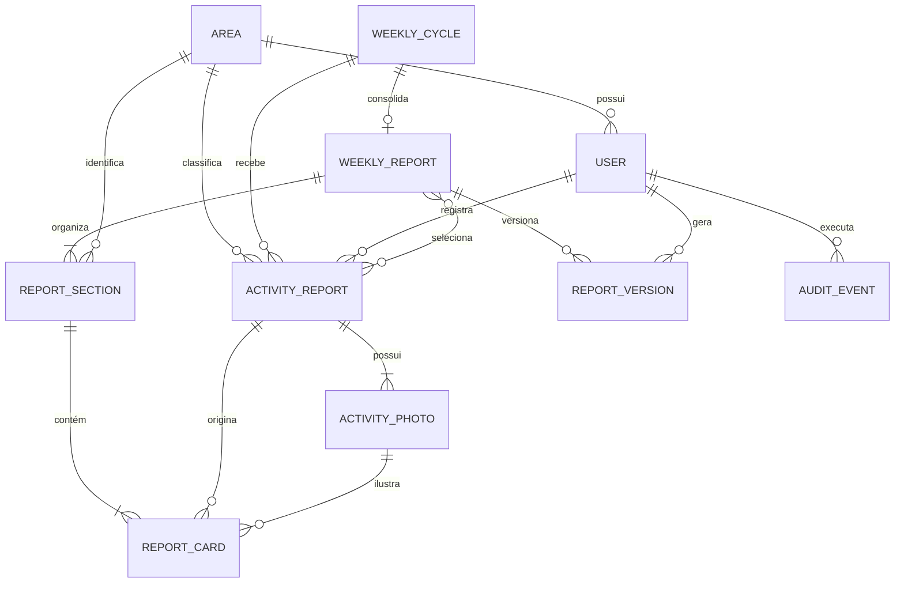

# Modelo de dados do synthesis

O esquema é mantido pelas migrations do Django e executado em PostgreSQL. IDs de domínio usam UUID; datas de criação e alteração usam `timestamp with time zone` no PostgreSQL.

## Relacionamentos



## Tabelas de domínio

| Tabela Django | Responsabilidade | Regra estrutural principal |
|---|---|---|
| `synthesis_area` | Áreas organizacionais | Nome único sem diferenciar maiúsculas e minúsculas |
| `synthesis_user` | Identidade, perfil e área | E-mail único sem diferenciar caixa; gestor exige área |
| `synthesis_weeklycycle` | Janela semanal de coleta | Datas válidas; status controlado; reabertura exige motivo |
| `synthesis_activityreport` | Relato original do gestor | Modelo versionado; conteúdo publicável curto e notas internas separadas |
| `synthesis_activityphoto` | Evidências fotográficas | No máximo uma foto principal por relato |
| `synthesis_weeklyreport` | Relatório consolidado e briefing executivo do ciclo | No máximo um relatório por ciclo |
| `synthesis_reportsection` | Agrupamento do relatório por área | Uma seção por área, com síntese curta opcional |
| `synthesis_reportcard` | Snapshot editorial e classificação executiva de um relato | Um relato por seção; remoção lógica preserva o original |
| `synthesis_reportversion` | PDF imutável do mosaico | Versão positiva e única dentro do mosaico |
| `synthesis_auditevent` | Trilha de operações críticas | Ator pode ser removido sem apagar o evento |

O relacionamento de seleção entre mosaicos e relatos é armazenado na tabela associativa automática `synthesis_weeklyreport_selected_activities`.

## Integridade e limites

O banco garante regras locais por `CHECK`, `UNIQUE`, chaves estrangeiras e índices condicionais. Regras que dependem de consultar outra tabela são validadas pelos serviços dentro de transações, entre elas:

- gestor, área e ciclo do relato devem ser compatíveis;
- a data da atividade precisa pertencer ao intervalo do ciclo;
- apenas um ciclo pode permanecer operacionalmente ativo; criação, encerramento, prazo e reabertura passam por serviços auditados;
- a foto escolhida pelo card precisa pertencer ao relato original;
- relatos selecionados precisam pertencer ao ciclo do mosaico;
- a seleção editorial não pode mudar depois da criação do mosaico;
- novos relatos devem usar um dos modelos ativos e respeitar os limites dos campos publicáveis;
- notas internas ficam apenas no relato e não são copiadas para o snapshot editorial;
- cards precisam respeitar o orçamento editorial antes da geração de um novo PDF;
- a síntese semanal é obrigatória para gerar o PDF, com no máximo três destaques e três pontos de atenção;
- destaques exigem evidência, decisões exigem pedido explícito e próximos passos exigem responsável e prazo;
- versões são numeradas sob bloqueio transacional do mosaico.

## Política de exclusão

- `PROTECT`: áreas, ciclos, autores, relatos originais, fotos selecionadas e versões históricas;
- `CASCADE`: fotos do relato e estrutura interna de um mosaico ainda não protegido;
- `SET_NULL`: ator de auditoria, preservando o evento após remoção do usuário.

## Índices de acesso

Os índices compostos atendem os fluxos usados pela API:

- ciclo + data dos relatos;
- gestor + ciclo e área + ciclo;
- status + início do ciclo;
- mosaico + ordem das seções;
- seção + remoção + ordem dos cards;
- mosaico + data das versões;
- entidade e ator da auditoria.

Para inspecionar o SQL gerado para a migração atual:

```bash
uv run python manage.py sqlmigrate synthesis 0002
```

Para aplicar o esquema:

```bash
uv run python manage.py migrate
```
